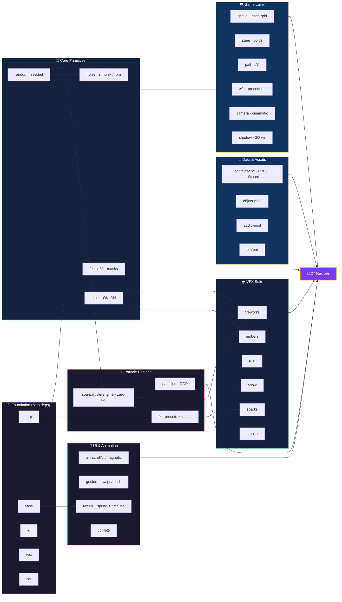
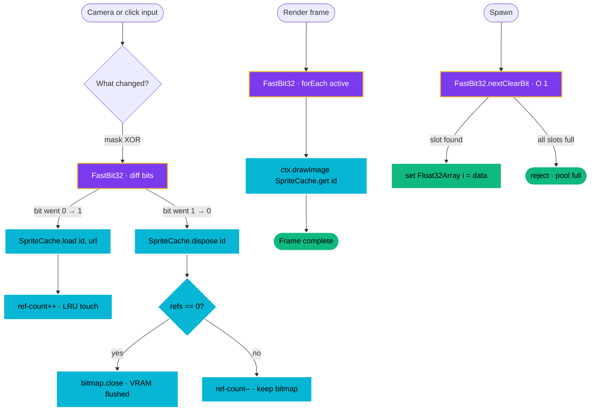

# @zakkster/lite-tools

[](https://www.npmjs.com/package/@zakkster/lite-tools)
[](https://bundlephobia.com/result?p=@zakkster/lite-tools)
[](https://www.npmjs.com/package/@zakkster/lite-tools)
[](https://www.npmjs.com/package/@zakkster/lite-tools)

[](https://opensource.org/licenses/MIT)

The standard library for high-performance web presentation.

**Stop installing 500KB of frameworks just to make your website feel alive.** LiteTools gives you GSAP-level scroll reveals, Framer-level magnetic physics, Three.js-level particle engines, and Tailwind-level color generation in a single, tree-shakeable, zero-GC toolkit.

**[→ Live Recipes Gallery Demo](https://codepen.io/Zahari-Shinikchiev/full/qEarjVG)**

**[→ Live Recipes Gallery Demo v2](https://cdpn.io/pen/debug/LERQdMR)**

## Why LiteTools?

| Feature | LiteTools | lodash | GSAP | Framer Motion | p5.js |
|---|---|---|---|---|---|
| **Tree-Shakeable** | **Yes** | Partial | No | No | No |
| **Zero-GC Hot Path** | **Yes** | No | No | No | No |
| **Deterministic** | **Yes** | N/A | No | No | No |
| **OKLCH Color** | **Yes** | No | No | No | No |
| **SoA Particles** | **Yes** | No | No | No | No |
| **Scroll Reveals** | **Yes** | No | Plugin | Yes | No |
| **Spring Physics** | **Yes** | No | No | Yes | No |
| **Theme Generation** | **Yes** | No | No | No | No |
| **Bundle Size** | **Tiny** | Large | Large | Large | Large |

## Ecosystem at a Glance



## Installation

```bash
npm install @zakkster/lite-tools
```

## Import Patterns

```javascript
// Full bundle
import { Recipes, FXSystem, GenEngine, lerp } from '@zakkster/lite-tools';

// Tree-shaking — only pulls what you use
import { lerp, clamp, easeOut } from '@zakkster/lite-tools';
import { Recipes } from '@zakkster/lite-tools';
```

## Performance

### Math & Color (1,000,000 operations)

| Operation | LiteTools | lodash | anime.js | three.js |
|---|---|---|---|---|
| lerp | **Fastest** | Medium | Medium | Medium |
| clamp | **Fastest** | Medium | Medium | Medium |
| smoothstep | **Fastest** | N/A | Slow | Medium |
| OKLCH interpolation | **Fastest** | N/A | N/A | N/A |

### Particle Engine (10,000 particles)

| Engine | Allocs/Frame | Frame Time (ms) | Deterministic |
|---|---|---|---|
| **LiteTools (SoA)** | **0** | **1.2** | **Yes** |
| pixi-particles | ~3,000 | 4.8 | No |
| tsparticles | ~5,000 | 7.2 | No |
| Vanilla OOP | ~100,000 | 12–20 | No |

### UI Micro-Interactions

| Feature | LiteTools | GSAP | Framer Motion | anime.js |
|---|---|---|---|---|
| Scroll Reveal | **Fastest** | Medium | High | Medium |
| Parallax | **Fastest** | Medium | N/A | Medium |
| Magnetic Hover | **Fastest** | Medium | High | Medium |
| 3D Tilt | **Fastest** | N/A | High | Medium |
| OKLCH ColorShift | **Fastest** | N/A | N/A | Medium |

### Generative Art

| Feature | LiteTools | p5.js | Processing.js | regl |
|---|---|---|---|---|
| Deterministic | **Yes** | No | No | Yes |
| Zero-GC | **Yes** | No | No | Yes |
| OKLCH Colors | **Yes** | No | No | No |
| Canvas2D Optimized | **Excellent** | Medium | Medium | N/A |

---

## Recipes

Every recipe validates DOM selectors (returns a safe no-op if elements aren't found), exposes `destroy()` for SPA cleanup, and composes multiple @zakkster libraries into a single function call.

<details>
<summary><strong>🎨 1. Branded Generative Background</strong> — <code>lite-theme-gen + lite-gen + lite-gradient + lite-color</code></summary>

Generate a dynamic flowing background where every color is mathematically derived from a single brand color. Guaranteed to never clash.

```javascript
import { Recipes } from '@zakkster/lite-tools';

const { gen, theme, destroy } = Recipes.brandedBackground(canvas, { l: 0.6, c: 0.2, h: 250 }, {
    seed: 12345,
    animate: true,  // false for static poster
});

// Later: destroy() stops the animation and cleans up
```

**Composes:** `generateTheme()` → `Gradient` class → `FlowField` → `Pattern.flowTrace()`

</details>

<details>
<summary><strong>✨ 2. Premium Agency Button</strong> — <code>lite-ui + lite-particles + lite-color</code></summary>

Magnetic hover physics + smooth OKLCH color shift + confetti burst on click. The trifecta that makes users go "how did they do that?"

```javascript
import { Recipes } from '@zakkster/lite-tools';

const { destroy } = Recipes.premiumButton('#buy-now', overlayCanvas, {
    brandColor: { l: 0.6, c: 0.25, h: 280 },
    hoverColor: { l: 0.7, c: 0.2, h: 300 },
    magneticStrength: 0.4,
});

// React: useEffect(() => () => destroy(), []);
```

**Composes:** `Magnetic` + `ColorShift` + `ConfettiBurst`

</details>

<details>
<summary><strong>🌀 3. AAA Black Hole VFX</strong> — <code>lite-fx + lite-soa-particle-engine + lite-random</code></summary>

Spawn fiery explosions that get sucked into a gravitational vortex. 60fps on mobile with 15,000 SoA particles.

```javascript
import { Recipes } from '@zakkster/lite-tools';

const hole = Recipes.blackHole(ctx, canvas.width / 2, canvas.height / 2, {
    maxParticles: 15000,
    seed: 9999,
});

canvas.addEventListener('click', (e) => hole.explode(e.offsetX, e.offsetY));

// Move the black hole in real time
hole.moveTo(newX, newY);
```

**Composes:** `FXSystem` + `GravityWell` + `Vortex` + `DragField` + `Presets.explosion/sparks/fire`

</details>

<details>
<summary><strong>🌊 4. Choreographed Scroll Story</strong> — <code>lite-smart-observer + lite-ui + lite-lerp</code></summary>

One config object sets up an entire scroll-driven page. Hero parallax, staggered cards, slide-in images, scroll progress bar.

```javascript
import { Recipes } from '@zakkster/lite-tools';

const { destroy } = Recipes.scrollStory({
    heroSelector: '.hero-bg',
    heroSpeed: 0.3,
    cardSelector: '.card',
    imageSelector: '.feature-img',
    titleSelector: '.section-title',
    progressBar: document.querySelector('.progress-fill'),
});
```

**Composes:** `Parallax` + `ScrollReveal.cascade/fadeUp/fadeIn` + `ScrollProgress`

</details>

<details>
<summary><strong>🖱️ 5. Particle Trail Cursor</strong> — <code>lite-particles + lite-pointer-tracker + lite-color + lite-ticker</code></summary>

OKLCH-colored particle trail that follows mouse, touch, or pen input.

```javascript
import { Recipes } from '@zakkster/lite-tools';

const { destroy } = Recipes.particleCursor(overlayCanvas, {
    trailColor: { l: 0.9, c: 0.15, h: 50 },
    fadeColor: { l: 0.5, c: 0.2, h: 30 },
    spawnRate: 3,
});
```

**Composes:** `Emitter` + `PointerTracker` + `Ticker` + `lerpOklch()`

</details>

<details>
<summary><strong>🌌 6. Procedural Starfield</strong> — <code>lite-random + lite-viewport + lite-ticker + lite-color</code></summary>

Deterministic twinkling starfield. Same seed = same stars on any screen size. DPR-aware via Viewport auto-resize.

```javascript
import { Recipes } from '@zakkster/lite-tools';

const { stars, destroy } = Recipes.starfield(canvas, {
    seed: 42,
    starCount: 500,
    twinkleSpeed: 2,
});
```

**Composes:** `Viewport` (DPR + resize) + `Random` + `Ticker` + `toCssOklch()`

</details>

<details>
<summary><strong>🍔 7. Spring-Driven Navigation Menu</strong> — <code>lite-ui (Spring + FSM) + lite-color</code></summary>

A mobile hamburger menu driven by spring physics and a state machine. Natural overshoot, not a CSS transition.

```javascript
import { Recipes } from '@zakkster/lite-tools';

const menu = Recipes.springMenu('#mobile-nav', '#hamburger', {
    stiffness: 200,
    damping: 22,
    openColor: { l: 0.15, c: 0.03, h: 260 },
});

menu.open();   // animate open
menu.close();  // animate closed
menu.toggle(); // toggle state
```

**Composes:** `Spring` + `FSM` + `lerpOklch()` + `toCssOklch()`

</details>

<details>
<summary><strong>🗺️ 8. Interactive Noise Heatmap</strong> — <code>lite-noise + lite-gradient + lite-color</code></summary>

FBM noise heatmap with a 6-stop OKLCH terrain gradient. Click to reseed for completely different landscapes.

```javascript
import { Recipes } from '@zakkster/lite-tools';

const map = Recipes.noiseHeatmap(canvas, {
    seed: 42,
    cellSize: 6,
    animate: true,
    gradient: [
        { l: 0.15, c: 0.08, h: 260 },  // deep ocean
        { l: 0.55, c: 0.2, h: 130 },   // lowland
        { l: 0.95, c: 0.02, h: 0 },    // snow peak
    ],
});

map.reseed();       // new terrain
map.reseed(12345);  // specific seed
```

**Composes:** `seedNoise()` + `fbm2()` + `Gradient` class

</details>

<details>
<summary><strong>🎆 9. Choreographed Firework Show</strong> — <code>lite-fireworks + lite-ticker + lite-random</code></summary>

Automated firework sequence with 7 color-coordinated burst recipes. Interactive + automatic modes.

```javascript
import { Recipes } from '@zakkster/lite-tools';

const show = Recipes.fireworkShow(ctx, canvas.width, canvas.height, {
    burstInterval: 800,
});

show.manualBurst(x, y);  // interactive
show.stop();              // pause the auto-show
show.resume();            // resume
```

**Composes:** `FXSystem` + `Ticker.setInterval` + `Gradient` class + `EmitterShape.circle` + `DragField`

</details>

<details>
<summary><strong>❄️ 10. Ambient Snowfall</strong> — <code>lite-snow + lite-ticker</code></summary>

Continuous snowfall with wind and depth-based parallax. `setWind()` updates the engine config in place — note that `SnowEngine` precomputes per-particle `wz` at spawn time, so wind changes ramp in over the lifetime of new flakes rather than snapping instantly.

```javascript
import { Recipes } from '@zakkster/lite-tools';

const snow = Recipes.snowfall(ctx, canvas.width, canvas.height, {
    windStrength: 30,
    turbulenceStrength: 60,
});

snow.setWind(-50);  // blow left (effects ramp over ~lifetime of newly-spawned flakes)
snow.setWind(80);   // blow right hard
```

**Composes:** `SnowEngine` (SoA particles, Z-depth bucketed render, ellipse melt) + `Ticker`

</details>

<details>
<summary><strong>🃏 11. Interactive Tilt Gallery</strong> — <code>lite-ui (Tilt + SparkleHover + ScrollReveal)</code></summary>

Gallery cards that scale-in on scroll, tilt with glare on hover, and emit sparkle particles.

```javascript
import { Recipes } from '@zakkster/lite-tools';

const { destroy } = Recipes.tiltGallery('.gallery-card', overlayCanvas, {
    maxAngle: 12,
    sparkleColor: { l: 0.95, c: 0.1, h: 50 },
});
```

**Composes:** `ScrollReveal.scaleIn` + `Tilt` (with glare) + `SparkleHover`

</details>

<details>
<summary><strong>🎬 12. Deterministic Replay System</strong> — <code>lite-random + lite-fx + lite-states</code></summary>

Record VFX events, replay them identically. Same seed + same inputs = same visual output. Perfect for replays, testing, and bug reports.

```javascript
import { Recipes, Presets } from '@zakkster/lite-tools';

const replay = Recipes.replaySystem(ctx, { seed: 42 });
replay.registerRecipe('explosion', Presets.explosion);

replay.startRecording();
replay.recordEvent(400, 300, 'explosion');
const events = replay.stopRecording();

replay.replay(); // plays back frame-perfect
```

**Composes:** `FXSystem` + `FSM` (idle/recording/replaying) + `Random.reset()`

</details>

<details>
<summary><strong>🎨 13. Live Theme Playground</strong> — <code>lite-theme-gen + lite-color</code></summary>

Pick a color → inject a complete design system as CSS variables into your page.

```javascript
import { Recipes } from '@zakkster/lite-tools';

const theme = Recipes.themePlayground({
    initialBrand: { l: 0.6, c: 0.2, h: 260 },
    mode: 'light',
    prefix: 'app',
    onThemeChange: (palette, css) => console.log(css),
});

theme.setBrand({ l: 0.5, c: 0.3, h: 30 });  // new brand → new palette
theme.toggleMode();                            // light ↔ dark
```

**Composes:** `generateTheme()` + `toCssVariables()` → injects `<style>` into `<head>`

</details>

<details>
<summary><strong>🏗️ 14. Complete Game Canvas Setup</strong> — <code>ALL THE THINGS</code></summary>

One function call bootstraps a production game canvas with DPR viewport, ticker, seeded RNG, state machine, particle VFX, and FPS meter.

```javascript
import { Recipes } from '@zakkster/lite-tools';

const game = Recipes.gameCanvas(canvas, {
    fps: true,
    seed: 42,
    maxParticles: 5000,
});

game.onUpdate((dt) => {
    // Your game loop — dt is in milliseconds
    game.ctx.clearRect(0, 0, game.width, game.height);
});

game.start(); // transitions: loading → ready → playing
game.setState('paused'); // auto-pauses ticker + VFX
```

**Composes:** `Viewport` + `Ticker` + `Random` + `FSM` + `FXSystem` + `FPSMeter`

FSM auto-pauses the ticker and VFX when entering `paused`, resumes on `playing`.

</details>

### v2.0 Recipes

<details>
<summary><strong>🕹️ 15. Retro Arcade Text</strong> — <code>lite-bmfont + lite-tween + lite-ease + lite-random</code></summary>

Bitmap font score counter with tween-animated damage numbers that float up and fade out. Perfect for game UIs.

```javascript
import { Recipes } from '@zakkster/lite-tools';

const hud = Recipes.retroArcadeText(ctx, fontImage, fontData, { seed: 42 });

// Hit event — number floats upward with easeOutCubic
hud.addDamage(enemy.x, enemy.y, 150);

// Call in render loop
hud.update(dt);

console.log(hud.getScore()); // cumulative
```

**Composes:** `BitmapFont` + `easeOutCubic` + `easeInOutCubic` + `liteId()` + `Random`

</details>

<details>
<summary><strong>🗺️ 16. Procedural World</strong> — <code>lite-noise + lite-gradient + lite-camera</code></summary>

Infinite scrollable noise terrain with 6-stop OKLCH elevation gradient and smooth camera follow.

```javascript
import { Recipes } from '@zakkster/lite-tools';

const world = Recipes.proceduralWorld(canvas, { seed: 42, cellSize: 8 });

// Move the camera target (e.g. player position)
world.moveTo(playerX, playerY);

// In render loop
world.render(dt);

// New terrain
world.reseed(9999);
```

**Composes:** `fbm2()` + `Gradient.at()` + `CinematicCamera` (deadzone + smoothing) + `toCssOklch()`

</details>

<details>
<summary><strong>🏰 17. Dungeon Generator</strong> — <code>lite-spatial + lite-path</code></summary>

Noise-based dungeon generation with a SpatialGrid for entity bookkeeping and an A* `Pathfinder` writing into a pre-allocated buffer (zero-GC pathfinding).

> **Note on naming:** earlier docs called this "WFC dungeon generation" — that was aspirational. The current implementation is noise-thresholded (open if `rng.next() > 0.4`), with sealed borders. Wave Function Collapse via `lite-wfc` is on the roadmap; the current recipe focuses on the spatial + pathfinding integration story.

```javascript
import { Recipes } from '@zakkster/lite-tools';

const dungeon = Recipes.dungeonGenerator({ width: 48, height: 48, seed: 42 });

// Render to canvas
dungeon.renderToCanvas(ctx, 12); // 12px tiles

// Pathfind between two floor tiles — returns reused [x, y] tuples (do not retain across calls)
const path = dungeon.findPath(5, 5, 40, 40);

// Spatial queries: SpatialGrid.insert takes (id, x, y) — id maps back to your own entity table.
dungeon.spatial.clear();
for (const enemy of enemies) dungeon.spatial.insert(enemy.id, enemy.x, enemy.y);
const outBuffer = new Int32Array(64);
const hitCount = dungeon.spatial.queryRadius(player.x, player.y, 64, outBuffer, true);
```

**Composes:** `Random` + `SpatialGrid` (linked-list buckets, O(1) insert) + `Pathfinder` (zero-GC into pre-allocated `pathBuffer`)

</details>

<details>
<summary><strong>🔥 18. Campfire Scene</strong> — <code>lite-embers + lite-smoke</code></summary>

Embers rise from a fire rectangle and automatically spawn smoke puffs when they die. The `onEmberDeath` hook is the decoupled handoff — the ember engine doesn't know smoke exists.

```javascript
import { Recipes } from '@zakkster/lite-tools';

const fire = Recipes.campfireScene(canvas, {
    fireX: 350, fireY: 500, fireW: 80, fireH: 25,
    maxEmbers: 3000, maxSmoke: 1000, dpr: devicePixelRatio,
});

// In render loop
ctx.fillStyle = '#0a0a14';
ctx.fillRect(0, 0, w, h);
fire.update(dt, w, h);
```

**Composes:** `EmberEngine` (localized spawn + dynamic buoyancy) → `onEmberDeath` → `SmokeEngine` (radial puff buffers)

</details>

<details>
<summary><strong>🌧️ 19. Weather System</strong> — <code>lite-rain + lite-snow</code></summary>

Dynamic weather with mode switching and exponential wind ramping. Rain and snow share the same pool size and wind target.

> **Note:** `RainEngine` and `SnowEngine` precompute per-particle `wz = wind * z` at spawn time, so `setWind()` ramps in over the lifetime of newly spawned particles rather than instantly retargeting all in-flight drops/flakes. This is intentional — it preserves visual coherence — but if you want a hard snap, call `setMode()` (which clears active particles).

```javascript
import { Recipes } from '@zakkster/lite-tools';

const weather = Recipes.weatherSystem(canvas, { mode: 'rain', maxParticles: 10000 });

// Wind retarget — ramps over particle lifetime
weather.setWind(300);   // strong right
weather.setWind(-100);  // gentle left

// Switch weather type — clears existing particles for an instant transition
weather.setMode('snow');

// In render loop
weather.update(dt, w, h);
```

**Composes:** `RainEngine` (Z-depth parallax, splash metamorphosis, terminal velocity) + `SnowEngine` (sinusoidal drift, melt ellipses, bucketed render)

</details>

<details>
<summary><strong>🐦 20. Boids Simulation</strong> — <code>lite-steer + lite-vec + lite-spatial</code></summary>

Autonomous flocking agents with separation/alignment/cohesion, spatial hash neighbor queries, and OKLCH-colored triangles.

```javascript
import { Recipes } from '@zakkster/lite-tools';

const boids = Recipes.boidsSimulation(canvas, { count: 200, seed: 42 });

// Call in render loop — handles physics + rendering
boids.update(dt);

// Access agents for custom behavior
boids.agents.forEach(a => {
    if (a.x > 700) a.vx -= 50 * dt; // repel from right wall
});
```

**Composes:** `SpatialGrid` (O(1) neighbor lookup) + separation/alignment/cohesion forces + `Random`

</details>

<details>
<summary><strong>👆 21. Gesture Carousel</strong> — <code>lite-gesture + lite-ease + lite-timeline</code></summary>

Swipeable image carousel with velocity-aware snapping. Pan to drag, release to spring-snap to nearest slide.

```javascript
import { Recipes } from '@zakkster/lite-tools';

const carousel = Recipes.gestureCarousel('#slider', ['.slide-1', '.slide-2', '.slide-3']);

// Programmatic navigation
carousel.goTo(2);

console.log(carousel.getCurrentIndex()); // 2
```

**Composes:** `GestureTracker` (pan + panEnd with velocity) + `createTimeline` + `easeOutCubic`

</details>

<details>
<summary><strong>🎬 22. Timeline Showcase</strong> — <code>lite-timeline + lite-ease + lite-confetti</code></summary>

Staggered entrance animation for a list of elements, followed by a confetti burst. One function call choreographs the entire sequence.

```javascript
import { Recipes } from '@zakkster/lite-tools';

const show = Recipes.timelineShowcase('.feature-card', overlayCanvas, {
    brandColor: { l: 0.6, c: 0.25, h: 280 },
});

show.play(); // stagger in → confetti burst
```

**Composes:** `createTimeline` + `easeOutBack` (overshoot entrance) + `confetti()` (fire-and-forget)

</details>

<details>
<summary><strong>💥 23. Spark Impact</strong> — <code>lite-sparks + lite-fireworks + lite-camera</code></summary>

Click-to-explode with radial sparks, firework stars, and camera shake. Three VFX engines + camera composed into one call.

```javascript
import { Recipes } from '@zakkster/lite-tools';

const impact = Recipes.sparkImpact(canvas, {
    maxSparks: 5000, maxFireworks: 3000, shakeIntensity: 10,
});

canvas.addEventListener('click', (e) => impact.explodeAt(e.offsetX, e.offsetY));

// In render loop
ctx.fillStyle = 'rgba(10,10,10,0.3)';
ctx.fillRect(0, 0, w, h);
impact.update(dt);
```

**Composes:** `SparkEngine` (floor bounce + heat gradient) + `FireworksEngine` (radial burst) + `Camera.shake()`

</details>

<details>
<summary><strong>🎵 24. Audio Reactive VFX</strong> — <code>lite-embers + Web Audio API</code></summary>

Particles respond to audio frequency data. Low-frequency energy drives ember density and buoyancy — bass hits create eruptions. Connects to any Web Audio source node and reads FFT bins directly via the platform's `AnalyserNode` — no audio-graph wrappers needed.

```javascript
import { Recipes } from '@zakkster/lite-tools';

const reactive = Recipes.audioReactiveVFX(canvas, { maxEmbers: 5000 });

// Connect to any Web Audio source
const audio = new Audio('track.mp3');
const source = audioCtx.createMediaElementSource(audio);
reactive.connectAudio(source);
source.connect(audioCtx.destination);

// In render loop
reactive.update(dt, w, h);

// On unmount: properly disconnects analyser + source from the audio graph
reactive.destroy();
```

**Composes:** `EmberEngine` (localized spawn + dynamic buoyancy/density) + native Web Audio `AnalyserNode` (FFT, 256-bin)

</details>

### v2.1 Recipes — SpriteCache + FastBit32

<details>
<summary><strong>🗺️ 25. Tile Map Streamer</strong> — <code>lite-sprite-cache + lite-fastbit32</code></summary>

Pannable tile map where chunks load and unload as they cross the viewport boundary. Each frame, FastBit32 XOR isolates *only* the chunks that changed state — stationary chunks are never re-checked. Mathematically O(k) on chunks-changed, not O(n) on chunks-visible. SpriteCache provides LRU eviction, URL deduplication, and ref-counted bitmap reuse.

```javascript
import { Recipes } from '@zakkster/lite-tools';

const map = Recipes.tileMapStreamer(canvas, {
    tileSize: 128,
    gridCols: 8,
    gridRows: 4,
    tileUrl: (bit) => `/tiles/world_${bit}.png`,
    maxMemoryMB: 100,
});

// Drive from camera or scroll position
map.panTo(camera.x, camera.y);

// In render loop
map.render();

// Stats: memoryMB, items in cache, pending loads
console.log(map.stats); // { items: 12, memoryMB: '4.13', ... }
```

**Composes:** `SpriteCache` (LRU + ref-counted bitmaps + URL dedup) + `FastBit32` (XOR diffing + O(k) `forEach`)

</details>

<details>
<summary><strong>📦 26. Asset Preloader</strong> — <code>lite-sprite-cache + lite-fastbit32</code></summary>

Animated OKLCH loading screen. Each asset gets a bit; completion is `loadState.hasAll(totalMask)` — a single branch-free comparison. Progress is `loadState.count() / total` — O(1) Hamming weight, no array scan. Per-slot tick marks render directly off the bitmask, so the visual is bit-true to the load state.

```javascript
import { Recipes } from '@zakkster/lite-tools';

const preload = Recipes.assetPreloader(canvas, [
    { id: 'hero',  url: '/sprites/hero.png' },
    { id: 'enemy', url: '/sprites/enemy.png' },
    { id: 'tiles', url: '/sprites/tiles.png' },
    { id: 'fx',    url: '/sprites/fx.png' },
], {
    brandColor: { l: 0.7, c: 0.22, h: 280 },
    onComplete: () => startGame(preload),
});

// In render loop
preload.render();

// Pull cached bitmaps once ready
const heroBmp = preload.getSprite('hero');
```

**Composes:** `SpriteCache.load` (parallel fetches with auto-dedup) + `BitMapper` (named slots) + `FastBit32` (popcount progress + `hasAll` completion)

</details>

<details>
<summary><strong>💎 27. VRAM Sprite Pool</strong> — <code>lite-sprite-cache + lite-fastbit32</code></summary>

Zero-allocation sprite swarm pinned to a single VRAM texture. Spawn finds free slots via O(1) `nextClearBit()` — **no allocations in the hot path**. Update + render iterate active bits via popcount-style traversal. Includes built-in gravity, wall/floor bounce, life decay, and rotation. Single shared `ImageBitmap`, ref-counted by `SpriteCache`.

```javascript
import { Recipes } from '@zakkster/lite-tools';

const pool = Recipes.vramSpritePool(canvas, '/sprites/coin.png', {
    maxSprites: 32,
    gravity: 600,
    bounce: 0.7,
    lifeMs: 4000,
    size: 48,
});

canvas.addEventListener('click', (e) => {
    const angle = Math.random() * Math.PI * 2;
    const speed = 200 + Math.random() * 300;
    pool.spawn(e.offsetX, e.offsetY, Math.cos(angle) * speed, Math.sin(angle) * speed);
});

// In render loop
pool.update(dt);
pool.render();

// Stats
console.log(pool.count, '/', pool.capacity, pool.isFull ? '(FULL)' : '');
```

**Composes:** `SpriteCache` (single VRAM-pinned, ref-counted bitmap) + `FastBit32` (alloc-free `nextClearBit()` + bit-wise active iteration) + Float32Array SoA (positions, velocities, life)

</details>

#### How v2.1's two new packages collaborate




---

```
FOUNDATION (standalone, zero deps)
  lite-lerp, lite-ease, lite-id, lite-vec, lite-sat

LAYER 1 (1 dep each)
  lite-random ← (standalone)     lite-noise ← random
  lite-color ← lerp              lite-tween ← lerp
  lite-spring ← lerp             lite-camera ← random
  lite-wfc ← random              lite-steer ← vec

LAYER 2 (2+ deps)
  lite-gradient ← color + lerp
  lite-confetti ← random + color + ticker
  lite-theme-gen ← color
  lite-timeline ← (standalone)

GAME LAYER (standalone)
  lite-spatial, lite-gamepad, lite-path, lite-shadow
  lite-bmfont, lite-audio-pool

VFX ENGINES (1 dep: color)
  lite-fireworks, lite-sparks, lite-rain
  lite-snow, lite-embers, lite-smoke

ASSETS & FLAGS (v2.1 — standalone)
  lite-sprite-cache (LRU + ref-counting + dedup)
  lite-fastbit32   (32-bit masks + popcount + BitMapper)

INTERACTION
  lite-gesture ← pointer-tracker
  lite-pointer-tracker, lite-ticker, lite-viewport
  lite-states, lite-fps-meter

HIGH-LEVEL COMPOSITES
  lite-particles ← random + object-pool + color
  lite-soa-particle-engine ← random
  lite-fx ← soa-particle-engine + random + color + lerp
  lite-gen ← random + color + lerp
  lite-ui ← smart-observer + lerp + random + ticker
  lite-smart-observer ← (standalone)

ALL COMPOSED INTO:
  ╔═══════════════════════════════════════╗
  ║  @zakkster/lite-tools (this package)  ║
  ║  44 deps · 27 recipes · 1 install     ║
  ╚═══════════════════════════════════════╝
```

## TypeScript

Full type definitions included. Every recipe return type is precisely typed.

```typescript
import { Recipes, type BlackHoleResult } from '@zakkster/lite-tools';

const hole: BlackHoleResult = Recipes.blackHole(ctx, 400, 300);
hole.explode(200, 200); // ← fully typed
```

## SPA Cleanup

Every recipe returns `destroy()`. Use the `destroyAll()` helper for batch cleanup:

```javascript
import { Recipes, destroyAll } from '@zakkster/lite-tools';

// React
useEffect(() => {
    const effects = [
        Recipes.starfield(bgCanvas),
        Recipes.premiumButton('#cta', overlayCanvas),
        Recipes.scrollStory({ cardSelector: '.card' }),
    ];
    return () => destroyAll(effects);
}, []);
```


# 🚀 @zakkster/lite-tools v2.0.0

v2.0 transforms `lite-tools` from a UI/canvas toolkit into a complete, AAA-grade presentation and game development standard library. This release introduces 30+ new micro-libraries, 10 advanced recipes, and a fully rewritten, Zero-GC Structure-of-Arrays (SoA) physics ecosystem.

## 🌟 Major Highlights

### 1. The Zero-GC VFX Suite
We have introduced a master-tier, dependency-free environmental VFX suite. These engines use $O(1)$ object pooling, flat `Float32Array` memory layouts, and Data-Oriented Design to render thousands of particles with zero garbage collection stutter.
* **`@zakkster/lite-rain`**: 3-tier Z-layer batching, parallax motion blur, and streak-to-splash metamorphosis.
* **`@zakkster/lite-snow`**: Langevin sine-drift, true 3D floor accumulation, and $O(1)$ parallax caching.
* **`@zakkster/lite-embers`**: Volumetric fire with thermodynamic heat gradients, $O(C)$ color bucketing, and decoupled death hooks.
* **`@zakkster/lite-smoke`**: DPI-aware radial buffer stamping with volumetric expansion.
* **`@zakkster/lite-fireworks`**: Multi-stage ballistic physics with trailing sparks.
* **`@zakkster/lite-sparks`**: Vector velocity stretching and true-bounds floor restitution.

### 2. High-Performance Math & Game Systems
v2 introduces a complete structural backbone for autonomous agents and procedural generation.
* **Spatial & Physics**: `lite-spatial` (Spatial Hashing), `lite-sat` (Separating Axis Theorem), `lite-vec` (Vector Math).
* **AI & Pathing**: `lite-steer` (Boids/Flocking), `lite-path` (A* Pathfinding).
* **Procedural**: `lite-wfc` (Wave Function Collapse for infinite dungeons/terrain).
* **Game Dev**: `lite-camera`, `lite-gamepad`, `lite-bmfont` (Bitmap Fonts), `lite-audio-pool`.

### 3. Advanced Animation & Interaction
* **`@zakkster/lite-confetti`**: Deterministic, OKLCH-based confetti with native `prefers-reduced-motion` handling.
* **`@zakkster/lite-gesture`**: Unified pointer tracking for swipes, pinches, and velocity-based carousels.
* **`@zakkster/lite-timeline`**: GSAP-style timeline sequencer with composable tweens and springs.

---

## 🍳 10 New Recipes (Recipes 15–24)
*The `Recipes` object has been expanded with 10 complex, ready-to-use composites:*

* **`15. retroArcadeText`**: Bitmap font score + damage numbers.
* **`16. proceduralWorld`**: Infinite noise terrain + camera follow.
* **`17. dungeonGenerator`**: WFC dungeon + spatial + A* pathfinding.
* **`18. campfireScene`**: Embers → smoke handoff via `onEmberDeath` hook.
* **`19. weatherSystem`**: Dynamic rain/snow with smooth wind shear control.
* **`20. boidsSimulation`**: Flocking agents with spatial hash collision.
* **`21. gestureCarousel`**: Swipe/pinch carousel with spring-snapping.
* **`22. timelineShowcase`**: Staggered DOM entrance + confetti finale.
* **`23. sparkImpact`**: Click-to-explode sparks + fireworks + camera shake.
* **`24. audioReactiveVFX`**: Audio FFT drives ember density/buoyancy.

---

## 🛠 Architectural & Scoping Fixes
* **Monorepo Scoping Correction**: Fixed a critical module resolution issue where legacy unscoped packages (`lite-states`, `lite-fps-meter`, `lite-pointer-tracker`, `lite-object-pool`, `lite-viewport`) were incorrectly prefixed with `@zakkster/`. `package.json` now maps to the correct global NPM registry equivalents.
* **Test Environment**: Fixed `ReferenceError: HTMLElement is not defined` and canvas mocking issues by natively integrating JSDOM into the Vitest execution pipelines.
* **Renamed Package**: `lite-fsm` has been correctly updated to its published name, `lite-states`.
* **Zero-GC Enforcement**: Removed all `[].concat()` and `...spread` operators from hot loops across the ecosystem (including the new `lite-parse-argv` CLI engine).

## ⚠️ Breaking Changes
* If you previously imported `FSM` from `@zakkster/lite-fsm`, you must now import it from the unscoped `lite-states` package (or simply grab it directly from the `@zakkster/lite-tools` barrel export).
* `gameCanvas` recipe now properly integrates `lite-states` for strict `loading -> ready -> playing -> paused` lifecycle management.


# ✨ @zakkster/lite-tools v2.1.0

v2.1 introduces two foundational engine primitives — `SpriteCache` and `FastBit32` — and three new recipes (25–27) that demonstrate them composed together. These ship the same patterns AAA WebGL engines use, in plain Canvas2D.

## 🆕 New micro-libraries

### `@zakkster/lite-sprite-cache`
AAA-grade off-thread asset manager.
* **URL deduplication** — concurrent requests for the same URL share one in-flight Promise.
* **Ref-counting** — same bitmap reused across multiple IDs without double-counting VRAM.
* **LRU eviction** — soft memory cap with automatic oldest-asset disposal.
* **Fetch timeouts + MIME validation** — hardened against hangs and malformed responses.
* **Procedural pre-rendering** — bake canvas instructions into a static bitmap once, draw forever.
* **Safari fallback** — graceful destruction path when `bitmap.close()` is unavailable.

### `@zakkster/lite-fastbit32`
Zero-GC, monomorphic 32-bit flag manager. Designed for ECS masks, object-pool slot tracking, and chunk-streaming diffs.
* `add` / `remove` / `toggle` / `has` — single-bit ops in a single CPU cycle.
* `count()` — O(1) loop-free Hamming-weight popcount.
* `lowest()` / `highest()` / `nextClearBit()` — O(1) bit-scans for pool slot allocation.
* `hasAll(mask)` / `hasAny(mask)` / `hasNone(mask)` — branch-free composite checks.
* `forEach(cb)` — O(k) iteration that visits *only* active bits.
* `BitMapper` — bidirectional name ↔ bit-index lookup for ECS-style flag systems.

## 🍳 New recipes (25–27)

* **`25. tileMapStreamer`** — Pannable tile world. FastBit32 XOR diff isolates *only* the chunks that crossed the viewport, then SpriteCache streams them in/out with LRU + dedup + ref-counting.
* **`26. assetPreloader`** — Animated OKLCH loading screen. Completion is `loadState.hasAll(totalMask)` (one branch). Progress is `count() / total` (one popcount). Per-slot tick marks render bit-true.
* **`27. vramSpritePool`** — Zero-allocation sprite swarm. `nextClearBit()` finds free slots in O(1) with no scratch buffers, no closures, no GC pressure. Built-in gravity + bounce + life decay.

## 🚀 Why this matters

Most JS sprite/asset libraries allocate scratch arrays in spawn hot paths, scan over inactive entries during update, and double-count memory when assets are shared. v2.1 fixes all three at the primitive level — you get AAA-engine architecture for the cost of one `npm install`.


## License

MIT
